# System Structure

## Technologies Used

- **Backend (Laravel)**:
  - Use **Laravel Authentication** (Jetstream) for registration/login.
  - Use **Eloquent ORM** for models and relationships.
  - Build **RESTful API** for Vue.js.
  - Use **Laravel Policies** for authorization.
  - Use **Laravel Notifications** to send notifications via email or store in the database.
  - Integrate **Laravel Scout** or **ElasticSearch** (if needed) for search.

- **Frontend (Vue.js)**:
  - Use **Vue Router** for navigation.
  - Use **Vuex** or **Pinia** for state management.
  - Call APIs with **Axios** or **Vue Query**.
  - Build UI with **Vuetify** or **Tailwind CSS** for responsiveness.
  - Integrate **Infinite Scroll** for topic/post lists.

- **Database**:
  - Use **MySQL** or **PostgreSQL**.

## Tables Used

### users

| Column | Data Type | Description |
| :--- | :--- | :--- |
| **`user_id`** | `uuid` | Primary key, unique user ID. |
| **`name`** | `string` | User’s name. |
| **`email`** | `string` | User’s unique email. |
| **`email_verified_at`** | `timestamp` | Email verification time. |
| **`password`** | `string` | Encrypted password. |
| **`role`** | `enum` | User role (Admin, Member, Moderator). |
| **`remember_token`** | `string` | Remember login token. |
| **`current_team_id`** | `foreignId` | User’s current team ID. |
| **`profile_photo_path`** | `string` | Profile picture path. |
| **`profile_cover_path`** | `string` | Cover photo path. |
| **`created_at`** | `timestamp` | Creation time. |
| **`updated_at`** | `timestamp` | Update time. |

### categories

| Column | Data Type | Description |
| :--- | :--- | :--- |
| **`category_id`** | `uuid` | Primary key, unique category ID. |
| **`parrent_id`** | `foreignUuid` | Parent category ID (if any). |
| **`title`** | `string` | Category title. |
| **`slug`** | `string` | Unique identifier string for URL. |
| **`description`** | `longText` | Detailed description. |
| **`created_at`** | `timestamp` | Creation time. |
| **`updated_at`** | `timestamp` | Update time. |

### follow_categories

| Column | Data Type | Description |
| :--- | :--- | :--- |
| **`user_id`** | `foreignUuid` | ID of the following user. |
| **`category_id`** | `foreignUuid` | ID of the followed category. |
| **`created_at`** | `timestamp` | Creation time. |
| **`updated_at`** | `timestamp` | Update time. |

### decentralization_of_categories

| Column | Data Type | Description |
| :--- | :--- | :--- |
| **`user_id`** | `foreignUuid` | ID of the authorized user. |
| **`category_id`** | `foreignUuid` | ID of the authorized category. |

### threads

| Column | Data Type | Description |
| :--- | :--- | :--- |
| **`thread_id`** | `uuid` | Primary key, unique thread ID. |
| **`title`** | `string` | Thread title. |
| **`slug`** | `string` | Unique identifier string for URL. |
| **`content`** | `longText` | Thread content. |
| **`user_id`** | `foreignUuid` | ID of the user who created the thread. |
| **`category_id`** | `foreignUuid` | ID of the category containing the thread. |
| **`is_locked`** | `boolean` | Thread locked status. |
| **`is_pinned`** | `boolean` | Thread pinned status. |
| **`created_at`** | `timestamp` | Creation time. |
| **`updated_at`** | `timestamp` | Update time. |

### follow_threads

| Column | Data Type | Description |
| :--- | :--- | :--- |
| **`user_id`** | `foreignUuid` | ID of the following user. |
| **`thread_id`** | `foreignUuid` | ID of the followed thread. |

### posts

| Column | Data Type | Description |
| :--- | :--- | :--- |
| **`post_id`** | `uuid` | Primary key, unique post ID. |
| **`content`** | `longText` | Post content. |
| **`user_id`** | `foreignUuid` | ID of the user who created the post. |
| **`thread_id`** | `foreignUuid` | ID of the thread containing the post. |
| **`parrent_id`** | `foreignUuid` | Parent post ID (for nested replies). |
| **`created_at`** | `timestamp` | Creation time. |
| **`updated_at`** | `timestamp` | Update time. |

### likes

| Column | Data Type | Description |
| :--- | :--- | :--- |
| **`post_id`** | `uuid` | Primary key, unique post ID. |
| **`content`** | `longText` | Post content. |
| **`user_id`** | `foreignUuid` | ID of the user who created the post. |
| **`thread_id`** | `foreignUuid` | ID of the thread containing the post. |
| **`parrent_id`** | `foreignUuid` | Parent post ID (for nested replies). |
| **`created_at`** | `timestamp` | Creation time. |
| **`updated_at`** | `timestamp` | Update time. |

### tags

| Column | Data Type | Description |
| :--- | :--- | :--- |
| **`tag_id`** | `uuid` | Primary key, unique tag ID. |
| **`name`** | `string` | Tag name. |
| **`description`** | `string` | Tag description. |
| **`slug`** | `string` | Unique identifier string for URL. |
| **`created_at`** | `timestamp` | Creation time. |
| **`updated_at`** | `timestamp` | Update time. |

### thread_tag

| Column | Data Type | Description |
| :--- | :--- | :--- |
| **`thread_id`** | `foreignUuid` | Thread ID. |
| **`tag_id`** | `foreignUuid` | Tag ID. |

### notifications

| Column | Data Type | Description |
| :--- | :--- | :--- |
| **`notification_id`** | `uuid` | Primary key, unique notification ID. |
| **`user_id`** | `uuid` | ID of the user receiving the notification. |
| **`content`** | `string` | Notification content. |
| **`is_read`** | `boolean` | Read status. |
| **`thread_id`** | `uuid` | Related thread ID. |
| **`post_id`** | `uuid` | Related post ID. |
| **`created_at`** | `timestamp` | Creation time. |
| **`updated_at`** | `timestamp` | Update time. |

### reports

| Column | Data Type | Description |
| :--- | :--- | :--- |
| **`user_id`** | `uuid` | ID of the reporting user. |
| **`thread_id`** | `uuid` | Reported thread ID. |
| **`reason`** | `string` | Report reason. |
| **`status`** | `enum` | Report status (Pending, Approved, Rejected). |
| **`created_at`** | `timestamp` | Creation time. |
| **`updated_at`** | `timestamp` | Update time. |

### images

| Column | Data Type | Description |
| :--- | :--- | :--- |
| **`image_id`** | `uuid` | Primary key, unique image ID. |
| **`url`** | `string` | Image URL path. |
| **`thread_id`** | `uuid` | ID of the thread containing the image. |
| **`post_id`** | `uuid` | ID of the post containing the image. |
| **`category_id`** | `uuid` | ID of the category containing the image. |
| **`created_at`** | `timestamp` | Creation time. |
| **`updated_at`** | `timestamp` | Update time. |

### deleted_images

| Column | Data Type | Description |
| :--- | :--- | :--- |
| **`id`** | `id` | Auto-increment primary key. |
| **`url`** | `string` | URL of the deleted image. |
| **`created_at`** | `timestamp` | Creation time. |
| **`updated_at`** | `timestamp` | Update time. |

### profile_images

| Column | Data Type | Description |
| :--- | :--- | :--- |
| **`profile_image_id`** | `uuid` | Primary key, unique profile image ID. |
| **`user_id`** | `foreignUuid` | ID of the user who owns the image. |
| **`original_url`** | `string` | Original image URL. |
| **`created_at`** | `timestamp` | Creation time. |
| **`updated_at`** | `timestamp` | Update time. |

### conversations

| Column | Data Type | Description |
| :--- | :--- | :--- |
| **`conversation_id`** | `uuid` | Primary key, unique conversation ID. |
| **`created_at`** | `timestamp` | Creation time. |
| **`updated_at`** | `timestamp` | Update time. |

### conversation_user

| Column | Data Type | Description |
| :--- | :--- | :--- |
| **`id`** | `id` | Auto-increment primary key. |
| **`user_id`** | `foreignUuid` | Participant user ID. |
| **`conversation_id`** | `foreignUuid` | Conversation ID. |
| **`created_at`** | `timestamp` | Creation time. |
| **`updated_at`** | `timestamp` | Update time. |

### messages

| Column | Data Type | Description |
| :--- | :--- | :--- |
| **`id`** | `id` | Auto-increment primary key. |
| **`content`** | `text` | Message content. |
| **`user_id`** | `foreignUuid` | ID of the message sender. |
| **`conversation_id`** | `foreignUuid` | Conversation ID. |
| **`is_read`** | `boolean` | Read status. |
| **`created_at`** | `timestamp` | Creation time. |
| **`updated_at`** | `timestamp` | Update time. |

### blocked_users

| Column | Data Type | Description |
| :--- | :--- | :--- |
| **`user_id`** | `foreignUuid` | ID of the blocking user. |
| **`blocked_user_id`** | `foreignUuid` | ID of the blocked user. |
| **`created_at`** | `timestamp` | Creation time. |
| **`updated_at`** | `timestamp` | Update time. |

### users_blocked_from_categories

| Column | Data Type | Description |
| :--- | :--- | :--- |
| **`user_id`** | `foreignUuid` | ID of the blocked user. |
| **`category_id`** | `foreignUuid` | ID of the blocked category. |
| **`created_at`** | `timestamp` | Creation time. |
| **`updated_at`** | `timestamp` | Update time. |

<br>

# How to play app

```shell
composer update
composer install
node forum-wislam-socket/index.js
php artisan serve --host=0.0.0.0
npm run dev # if you want to dev
npm run build # if you don't want to dev
```

<br>

# Some pictures of the application

## Home page

### 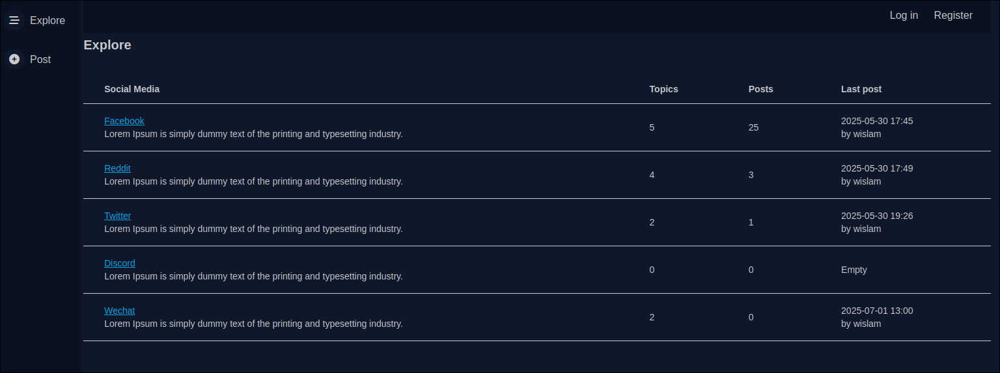

### 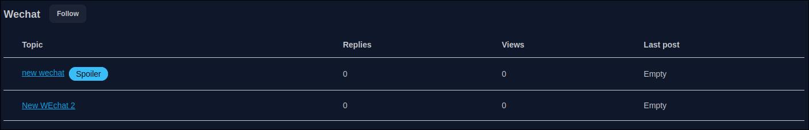

### 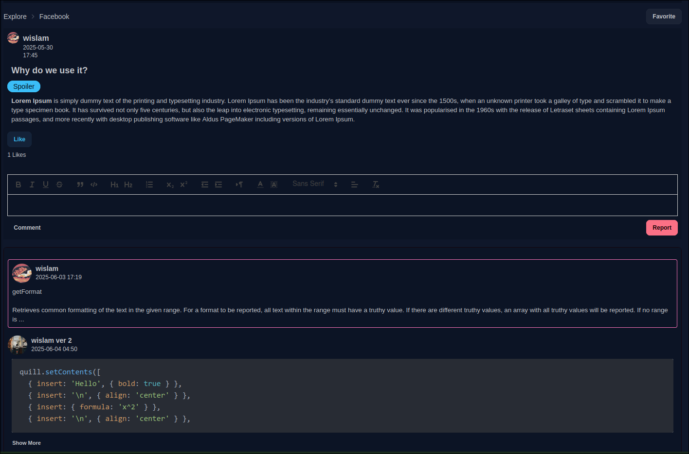

## Login

### 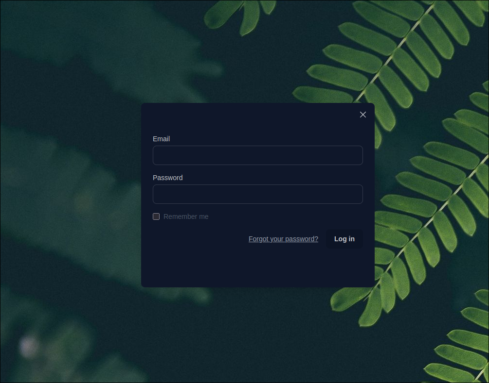

## Register

### 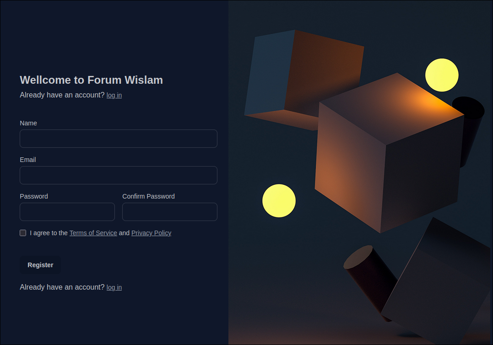

## New Post

### Upload new post

### 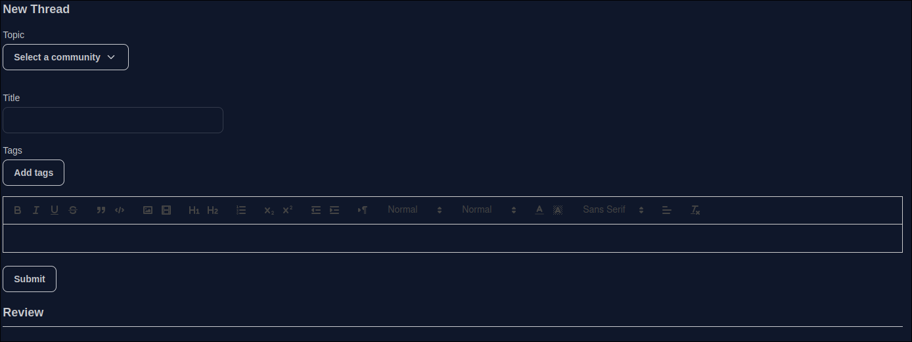

### Edit comment

### 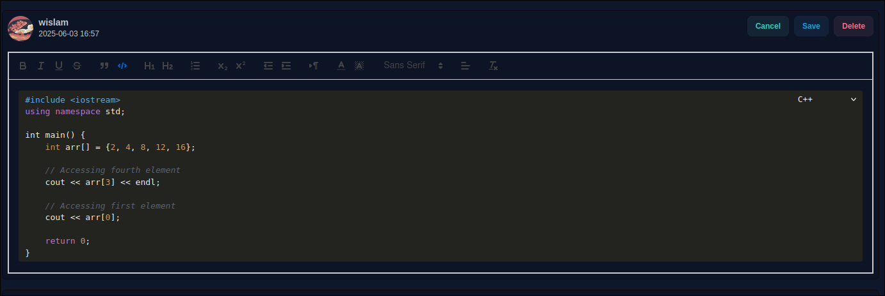

## Dashboard

### 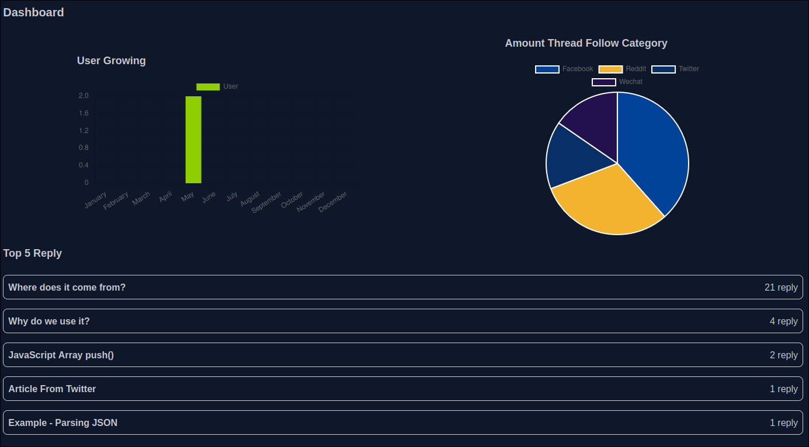
### 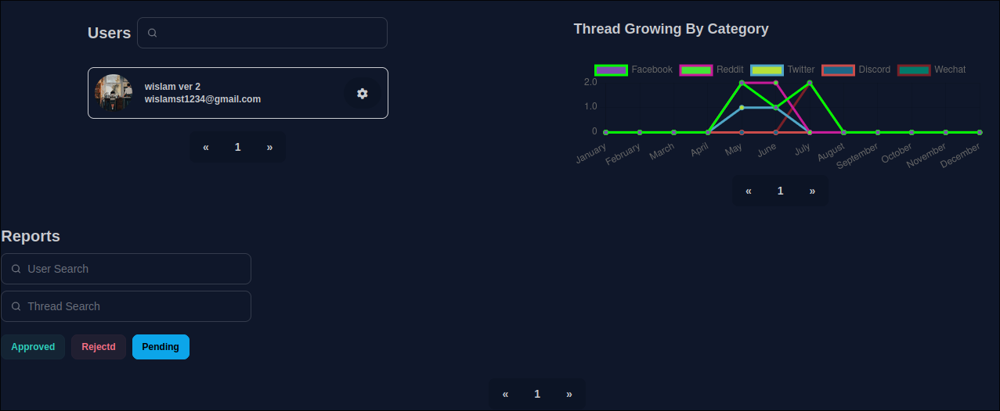

## Category Management

### 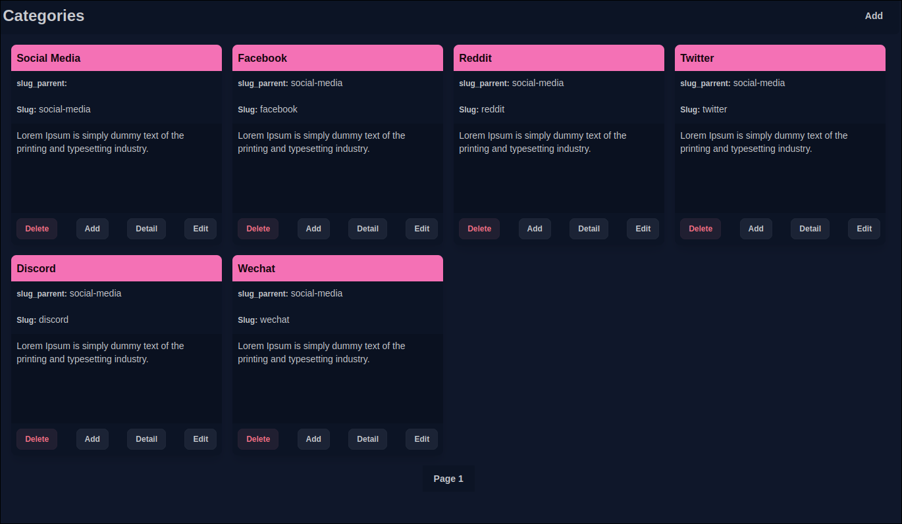

## Tag Management

### 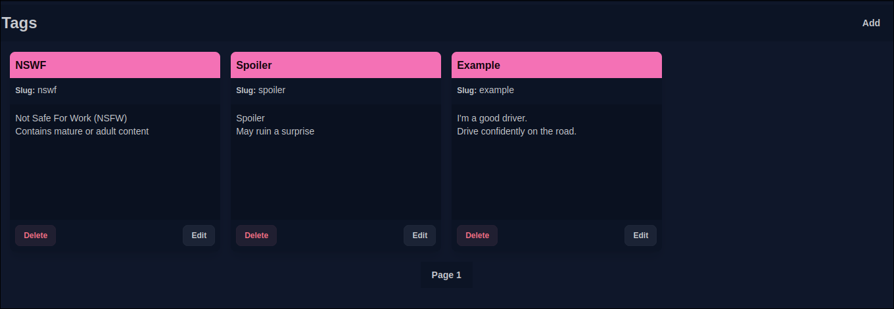

## Message

### 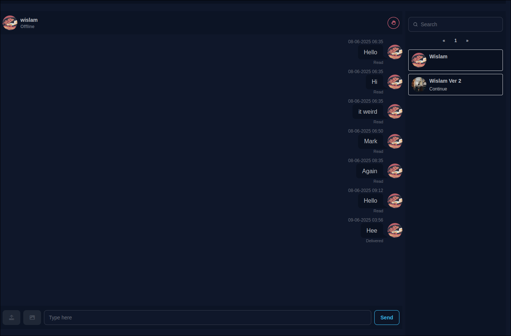

### Profile

### 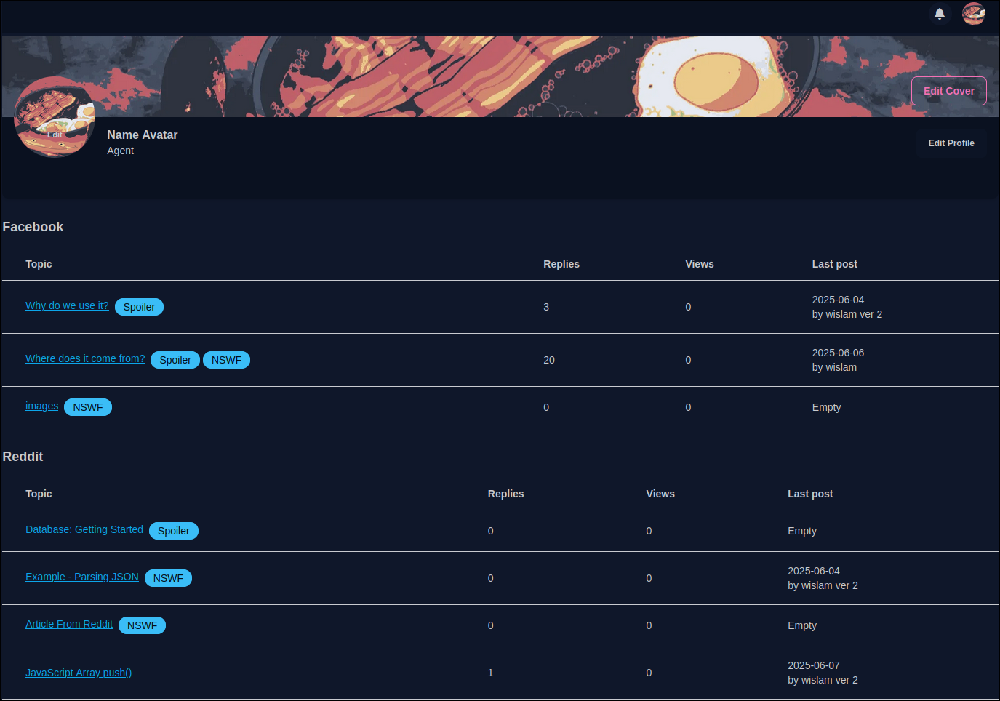

### 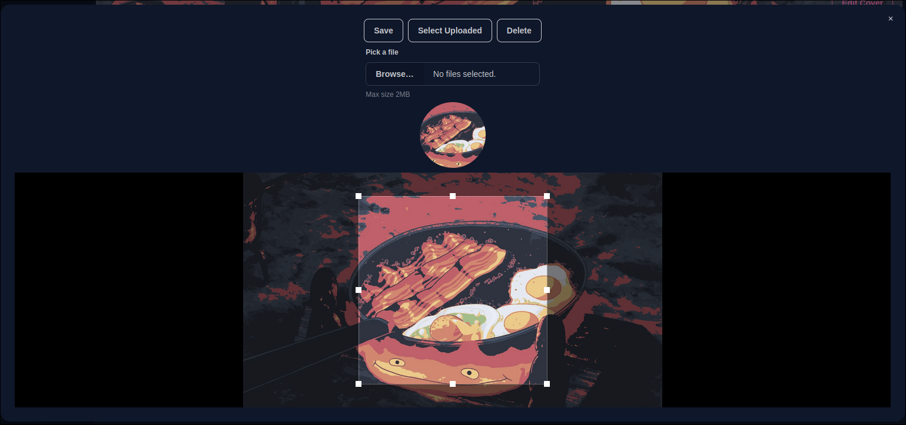

### 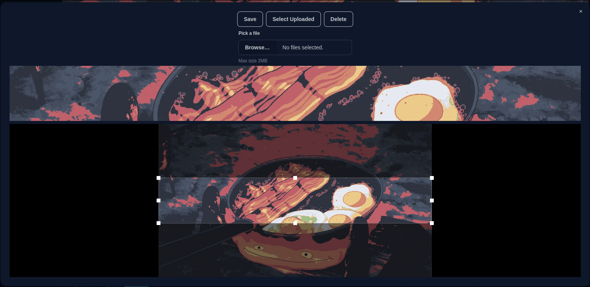
